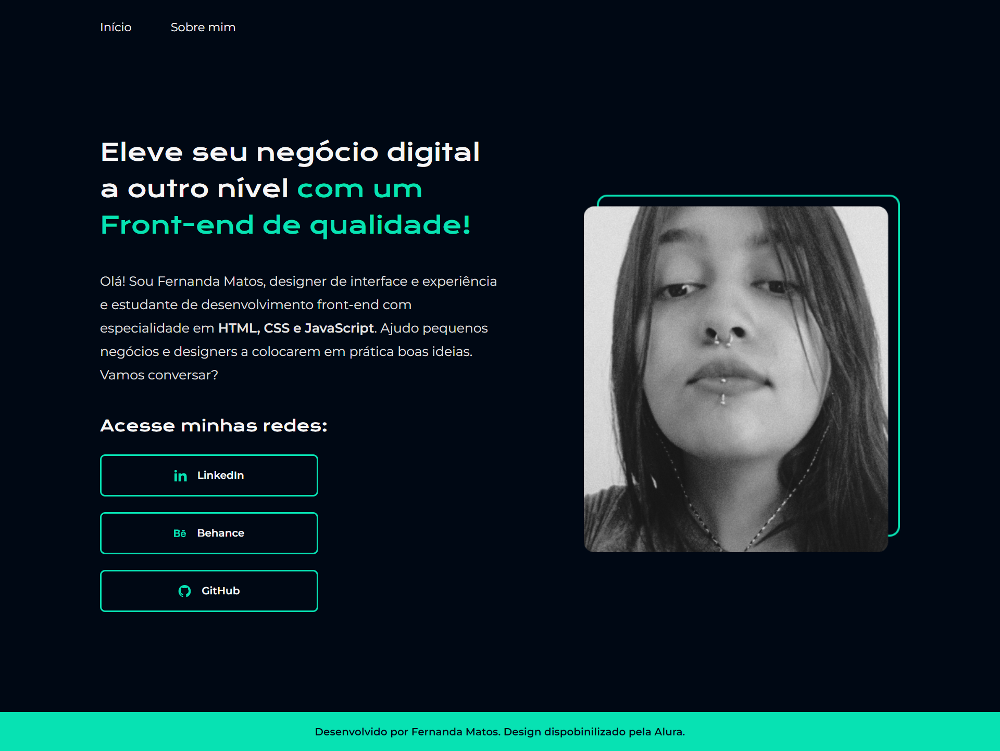

# Portfólio Alura

Esse é um estudo de caso ensinado pela Alura e desenvolvido por mim para colocar em prática os conceitos de HTML, CSS, Flexbox, variáveis CSS e responsividade.

[Visualizar projeto ao vivo](https://ferlimatos.github.io/alura-portfolio)
# 🕹 Tecnologias

Neste projeto foram utilizadas as seguintes tecnologias:

